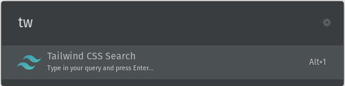
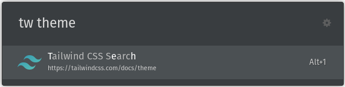
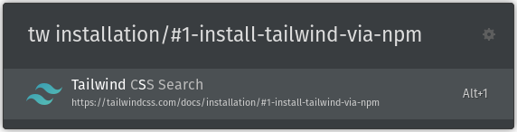

<p align="center ">
  
</p>
<p align="center">
  
</p>

#Tailwind CSS Extension for  [Ulauncher - Application launcher for Linux](https://ulauncher.io/)

Ulauncher extension for quick access to the Tailwind CSS documentation.


Once you install this extension, just start Ulauncher `ctrl+space` and type: `tw`. That will start the extension.



From there you can type the slug of the documentation page you want to read like so: `tw theme` and press `Enter`. That will open your browser to the theme page for the latest version of Tailwind CSS.




##Requirement
- [Ulauncher](https://ulauncher.io) version `v5.3.0~beta1 `
- [Ulauncher API](http://docs.ulauncher.io/en/latest/) version `2.0.0`
- Python > `v3`
## Installation

Open ulauncher `preferences` window -> `extensions` -> `add extension` and paste the following url:

```
https://github.com/ImtiazEpu/ulauncher-tailwindcss-extension